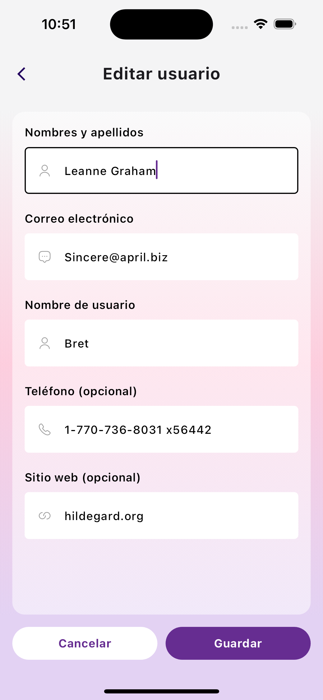
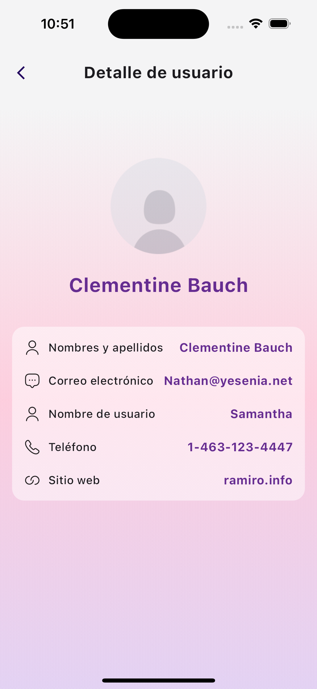

# Flutter User Management App (Userly)

This is a sample Flutter application for managing users. It demonstrates the use of GetX for state management and connects to the JSONPlaceholder API for user data.

Live demo: https://www.youtube.com/watch?v=nwlottSG9EU

## Screenshots

|         User List         |           Add User           |
| :-----------------------: | :--------------------------: |
|  |  |

|           Edit User           |           Detail User           |
| :---------------------------: | :-----------------------------: |
|  |  |

## Features

- View a list of users
- View details of a specific user
- Add a new user (mock)
- Edit an existing user (mock)
- Delete a user (mock)
- State management using GetX

## Requirements

- Flutter SDK (version 2.5.0 or later)
- Dart SDK (version 2.14.0 or later)

## Getting Started

Follow these instructions to set up and run the project on your local machine.

### Installation

1. **Clone the repository:**

   ```bash
   git clone https://github.com/eduuuJS/flutter_challenge_userly.git
   cd flutter_challenge_userly
   ```

2. **Install dependencies:**

   ```bash
   flutter pub get
   ```

3. **Run the application:**

   ```bash
   flutter run
   ```

## Project Structure

```plaintext
lib/
├── main.dart
├── app/
│   └── data/
│   │   ├── dtos/
│   │   │   └── response_user_dto.dart
│   │   └── repository/
│   │       └── user_repository.dart
│   └── domain/
│   │   ├── action_type.dart
│   │   └── user.dart
│   └── presentation/
│       ├── components/
│       │   ├── icon_wrapper.dart
│       │   ├── input_primary.dart
│       │   └── primary_button.dart
│       └── screens/
│           ├── add_edit_user/
│           ├── detail_user/
│           ├── splash/
│           └── users/
└── core/
    ├── config/
    │   └── app_config.dart
    ├── environment/
    │   └── environment.dart
    ├── network/
    │   ├── interceptors/
    │   │   └── logger_interceptor.dart
    │   ├── dio_client.dart
    │   └── dio_config.dart
    ├── routes/
    │   ├── app_routes.dart
    │   └── app_views.dart
    ├── theme/
    │   ├── app_colors.dart
    │   └── app_theme.dart
    └── utils/
       ├── dependency_injection.dart
       ├── helpers.dart
       └── validators.dart


```

- `main.dart`: Entry point of the application.
- `app/`: Contains the features of the application.
- `app/data/`: It is the data exchange layer with any external service.
- `app/data/dtos/`: Contains the data transfer objects (DTO) used for data exchange.
- `app/data/repository/`: Contains the repository classes for data access.
- `app/domain/`: Contains the domain layer of the application.
- `app/domain/action_type.dart`: Contains the action types used in the application.
- `app/domain/user.dart`: Contains the user domain model.
- `app/presentation/`: Contains the presentation layer of the application.
- `app/presentation/components/`: Contains the reusable components of the application.
- `app/presentation/screens/`: Contains the screens of the application. Each screen contains its respective GetxController to manage its state and its Binding to inject the controller.
- `core/`: Contains environment settings, http client settings, etc.
- `core/config/`: Contains the configuration of the application execution environment.
- `core/environment/`: Contains the runtime environments available for the application.
- `core/network/`: Contains the configuration of the http client (Dio) and its respective interceptors (Logger).
- `core/routes/`: Contains the routes of the application.
- `core/theme/`: Contains the application theme.
- `core/utils/`: Contains the utilities for the application.

## API Endpoints

The application uses the JSONPlaceholder API for mock data. The following endpoints are used:

- **Get users:** `GET https://jsonplaceholder.typicode.com/users`
- **Add user:** `POST https://jsonplaceholder.typicode.com/users` (mock)
- **Edit user:** `PUT https://jsonplaceholder.typicode.com/users/{id}` (mock)
- **Delete user:** `DELETE https://jsonplaceholder.typicode.com/users/{id}` (mock)

## Usage

### Viewing Users

On the main screen, you will see a list of users fetched from the JSONPlaceholder API. Each user tile displays the user's name and email. Tap on a user to view more details.

### Adding a User

Tap the floating action button (FAB) on the main screen to navigate to the add user screen. Fill in the user details and tap "Save" to add the user. This is a mock operation and will not persist data.

### Editing a User

On the user details screen, tap the "Edit" button to navigate to the edit user screen. Modify the user details and tap "Save" to update the user. This is a mock operation and will not persist data.

### Deleting a User

On the user details screen, tap the "Delete" button to remove the user. This is a mock operation and will not persist data.

## Notes

- The application uses mock operations for adding, editing, and deleting users. These operations will not persist data and are for demonstration purposes only.
- The project uses GetX for state management to provide a responsive and efficient user experience.

## Contributing

Feel free to open issues or submit pull requests if you have any suggestions or improvements.

## License

This project is licensed under the MIT License. See the [LICENSE](LICENSE) file for more details.
